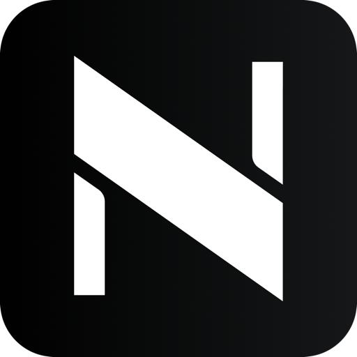

<p align="center">
  
</p>

<h1 align="center"><a href="https://github.com/mewcoder/NCode">NCode</a></h1>

<p align="center">
  NCode 是基于 ZCode 源码二次开发的 AI 编程工作台，目标是精简不需要的官方功能，同时保留通用开发能力和上游兼容。<br />
  本项目独立维护，不代表 ZCode 或 Z.ai 官方产品。
</p>

## 功能差异

- 精简官方登录、订阅等入口及相关权益查询。
- 隐藏分享、社区、反馈等相关入口。
- 停用遥测上报、应用内更新检查及更新入口。
- 提供可单独开关的动态工作流，通过内置 `CreateWorkflow` 工具编排多个子代理。

## 动态工作流

在请求中明确说明“用工作流”或“使用动态工作流”，模型会加载 `dynamic-workflows` 技能，并调用内置 `CreateWorkflow` 工具。它以 TypeScript 编排多个子代理，支持并行执行、条件和循环控制以及结果汇总。脚本通过类型检查并经你确认后，会在后台运行，完成时返回结果。

可在“设置 > Agent 能力 > 子代理”中开关动态工作流，默认开启。开关对之后新建或恢复的会话生效；已经启动的工作流会继续运行。

## 保留能力

- API Key、自定义 Provider 和本地 Automations/Cron。
- 插件市场，包括官方源；通用 MCP OAuth。
- SSH、WSL、Docker 远程工作区。
- CLI 命令仍为 `zcode`。

## 快速上手

需要 Git、Node.js 24.14.0 和 pnpm 10.33.2。在仓库根目录运行：

```bash
pnpm bootstrap  # 安装依赖并准备桌面运行资源
pnpm dev:desktop  # 启动桌面版
```

## 本地打包

macOS arm64：

```bash
pnpm bundle:desktop -- --os mac --arch arm64
```

Windows x64：

```bash
pnpm bundle:desktop -- --os win --arch x64
```

安装包输出到 `packages/desktop/dist/`。

## 兼容说明

为兼容上游和既有数据，内部包名、`zcode` 命令、`ZCODE_*` 环境变量、`.zcode` 数据目录及 `zcode://` 协议保持不变。NCode 不迁移既有 ZCode 数据。

## 来源与许可

本项目基于 [ZCode 上游源码](https://github.com/zai-org/ZCode) 二次开发。许可证、版权归属和第三方声明见 [LICENSE](LICENSE) 与 [NOTICE.md](NOTICE.md)。
